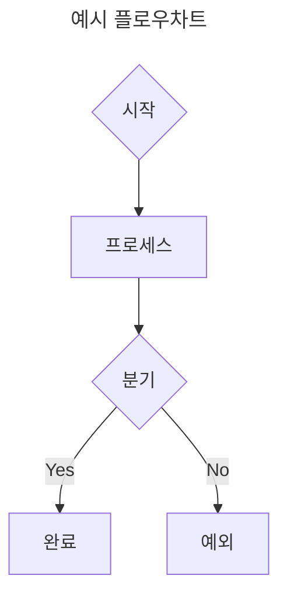

# Mermaid 다이어그램 생성

사용자의 요구사항에 따라 Mermaid 플로우차트 다이어그램(.mmd) 파일을 생성합니다.

## 트리거

사용자가 다이어그램, 플로우차트, Mermaid, 흐름도 생성을 요청할 때 이 스킬을 사용합니다.

## 공통 템플릿 자산

이 스킬 폴더에 공통 CSS/JS/HTML/폰트가 포함되어 있습니다:

```
skills/Diagram/diagrams/
├── template/
│   ├── viewer.html        # 범용 Mermaid 뷰어 (?file= 파라미터로 .mmd 로드)
│   ├── style.css          # 공통 CSS + @font-face
│   └── mermaid-theme.js   # Mermaid 초기화 + classDef 주입 + 후처리
└── fonts/
    └── OngleafParkDahyun.ttf  # 온글잎 박다현체
```

사용자 프로젝트에 `diagrams/template/` 또는 `diagrams/fonts/`가 없으면, 이 스킬 폴더의 파일을 사용자 프로젝트의 `diagrams/` 디렉토리로 복사하세요:

```bash
cp -rn <이_스킬_폴더>/diagrams/template <사용자_프로젝트>/diagrams/
cp -rn <이_스킬_폴더>/diagrams/fonts <사용자_프로젝트>/diagrams/
```

## 실행 절차

### 1단계: .mmd 파일 생성

사용자의 요구사항에 따라 `diagrams/<파일명>.mmd` 파일을 생성합니다.

#### .mmd 작성 규칙

- YAML front matter로 `title:` 지정
- `flowchart TD` (Top-Down) 기본 방향
- 노드에 `:::클래스명`으로 스타일 지정
- `classDef`, `linkStyle`은 작성하지 않음 (뷰어가 자동 주입)

#### 사용 가능한 클래스

| 클래스 | 용도 | 색상 |
|--------|------|------|
| `startEnd` | 시작/종료 노드 | 파란색 (#339af0) |
| `process` | 일반 프로세스 | 초록색 (#2f9e44) |
| `decision` | 분기/판단 | 주황색 (#f08c00) |
| `exception` | 예외/에러 | 빨간색 (#e03131) |
| `complete` | 완료/성공 | 보라색 (#7048e8) |

#### 노드 형태 규칙

- `{텍스트}` — 다이아몬드 (시작/종료/분기)
- `[텍스트]` — 사각형 (프로세스)
- `["텍스트"]` — 특수문자가 포함된 사각형

#### 예시



### 2단계: 프리뷰 안내

생성 후 사용자에게 프리뷰 방법을 안내합니다:

```
프리뷰 방법:
1. python3 -m http.server 8765 --directory diagrams
2. 브라우저에서 열기: http://localhost:8765/template/viewer.html?file=<파일명>
```
